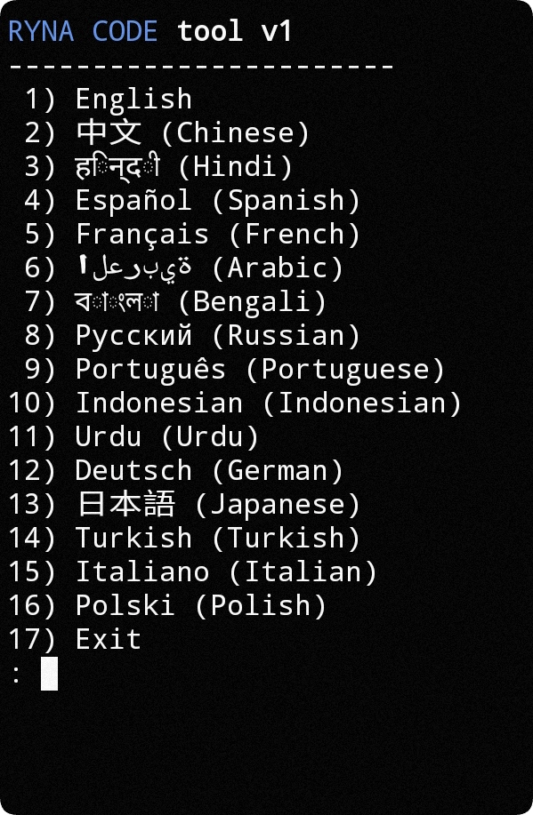
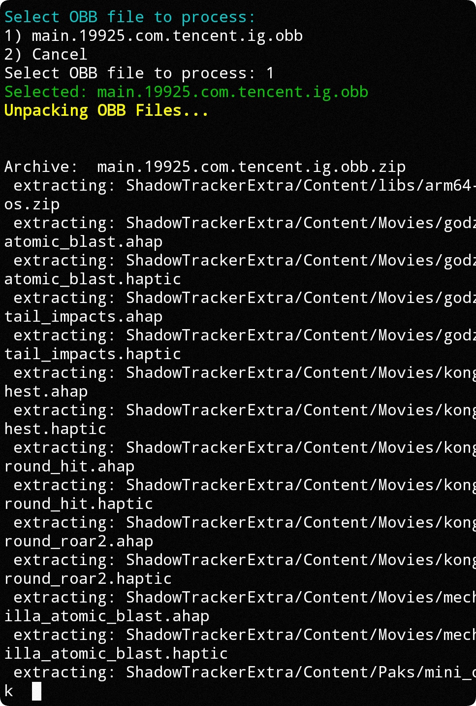
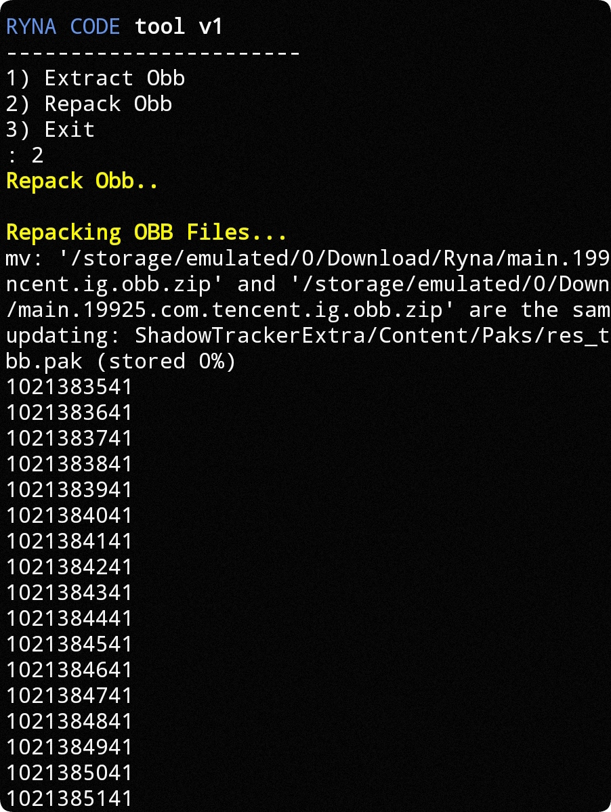

<h1 align="center">TERMUX OBB TOOL</h1>

<p align="center">
  
</p>

## 📌 Introduction
RYNA CODE OBB Tool is a simple bash script designed for Termux that helps you unpack and repack Android OBB files with ease. This tool is perfect for game modders, developers, or anyone who needs to work with OBB files.

## 🛠️ Features
- Unpack OBB files (extract contents)
- Repack OBB files (create new OBB)
- Supports multiple languages (16 languages available)
- Simple menu-driven interface
- Automatic dependency installation

## ⚙️ Installation

### Prerequisites
- Android device with Termux installed
- Basic storage permissions

### Installation Steps
1. Open Termux
2. Copy and paste the following commands one by one:

```bash
pkg update -y
```
```bash
pkg install git -y
```
```bash
git clone https://github.com/SethConfig/termux-obb-tool
```
```bash
cd termux-obb-tool
```
```bash
chmod +x OBB
```
```bash
bash OBB
```

## 🖥️ Usage Guide

### First Run Setup
When you first run the script:
1. It will automatically install required dependencies
2. Ask for storage permissions (accept when prompted)
3. Present a language selection screen (shown below)



### Main Menu Options
After setup, you'll see the main menu with three options:

1. **Extract Obb** - Unpack an OBB file
2. **Repack Obb** - Create an OBB file from extracted contents
3. **Exit** - Close the program

### How to Unpack an OBB File
1. Select option 1 (Extract Obb) from the main menu
2. The script will show available OBB files in your Download folder
3. Select the OBB file you want to extract
4. The tool will automatically:
   - Convert OBB to ZIP
   - Extract contents
   - Preserve original file size information
   


### How to Repack an OBB File
1. First, make sure you have:
   - An extracted OBB folder in the Ryna directory
   - The original .obb.zip file in the Ryna directory
2. Select option 2 (Repack Obb) from the main menu
3. The tool will:
   - Repackage the contents
   - Maintain the original file size
   - Create a new .obb file
   


## 📂 File Locations
- **Original OBB files**: Place these in `/storage/emulated/0/Download/`
- **Extracted files**: Found in `/storage/emulated/0/Download/Ryna/`
- **Repacked OBB**: Created in `/storage/emulated/0/Download/Ryna/`

## ❓ Common Questions

**Q: Why isn't my OBB file showing up?**
A: Make sure:
- The file is in `/storage/emulated/0/Download/`
- The file has .obb extension (case matters)
- You've granted Termux storage permissions

**Q: The repacked OBB doesn't work. Why?**
A: The tool maintains file size but cannot fix corrupted or improperly modified files. Make sure:
- You didn't delete any important files
- You didn't change the folder structure
- The modifications you made are compatible with the app/game

**Q: Can I use this on PC?**
A: No, this is specifically designed for Termux on Android.

**https://m.youtube.com/@sayretna**
